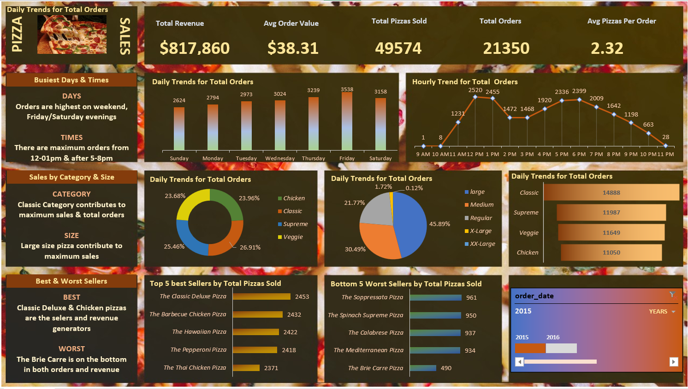

## Technical Skills
- Advanced Excel
- SQL
- Power BI
- Data Cleaning & Transformation
- Data Visualization
- Statistical Analysis – Descriptive stats, trends
- Database Management 

## Education
- BSc Software Engineering | Multimedia University of Kenya (_May 2025_)
- Microsoft Power BI Data Analyst | Microsoft (_January 2025_)						       		
- Software Development	| Safaricom PLP Program (_June 2025_)	 			        		

## Work Experience
IT SUPPORT ASSISTANT - KIPCHABO OUTGROWERSSACCONov 2023 - Mar 2025
• Provided front-line customer service and IT support to Saccomembersand staff. 
• Assisted members with account-related inquiries, deposits, withdrawals,and loan information. 
• Helped maintain accurate member records and updated customer datainthe system. 
• Guided members on how to use mobile banking and online accountservices. 
• Answered calls and resolved service issues, demonstratingprofessionalism and empathy. 
• Promoted Sacco products and services to meet member needs. 
• Maintained confidentiality of sensitive infomration.

JUNIOR IT INTERN - KENYA FORESTRY RESEARCH INSTITUTE (May 2023 - Jul 2023)
• Provided technical assistance to staff and visitors on IT-relatedissues. •Responded to internal support requests via email and phoneinatimelymanner. 
• Participated in data entry and report formatting tasks requiringprecision.•Assisted in setting up and maintaining computer systems andofficeequipment.
• Demonstrated teamwork and communication when workingwithdepartments. 
• Answered general inquiries at the front desk and directed visitors.

## Projects
### Interactive Power BI Dashboard for Pizza Sales Analysis
This project involved building an end-to-end data analytics solution to explore, clean, and visualize pizza sales data. I used SQL to query and extract insights from structured data, Excel for initial data cleaning and exploration, and Power BI to design a dynamic, interactive dashboard.

