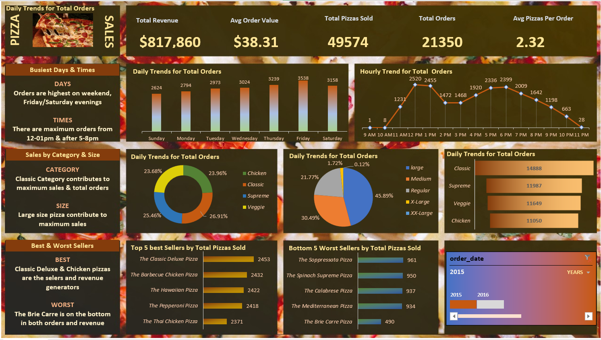

# Data Scientist

#### Technical Skills: Python, SQL, AWS, Snowflake, MATLAB

## Education
- BSc Software Engineering | Multimedia University of Kenya (_May 2025_)								       		
- Software Development	| Safaricom PLP Program (_June 2025_)	 			        		

## Work Experience

## Projects
### Interactive Power BI Dashboard for Pizza Sales Analysis
This project involved building an end-to-end data analytics solution to explore, clean, and visualize pizza sales data. I used SQL to query and extract insights from structured data, Excel for initial data cleaning and exploration, and Power BI to design a dynamic, interactive dashboard.

